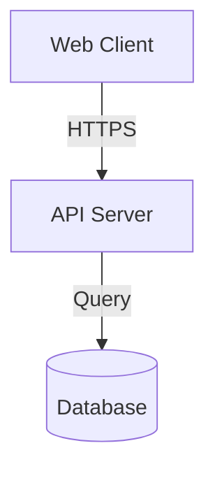

# Migration Guide: v1.0.0 → v2.0.0

This guide helps you upgrade from Catalyst v1.0.0 to v2.0.0.

## Overview of Changes

### What's New in v2.0.0

**3 New Skills:**
- 📊 **Monitor** - Production observability and logging
- 🔒 **Secure** - Security auditing and OWASP compliance
- ✅ **Test** - Comprehensive testing with >80% coverage

**Enhanced Skills:**
- 🔥 **Ignite** - Now includes cost analysis, security assessment, performance benchmarks
- 🏗️ **Architect** - Now generates Mermaid diagrams and OpenAPI 3.0 specs
- ⚡ **Deploy** - Now includes quality checks, security scanning, progress tracking
- 🚀 **Ship** - Now includes comprehensive E2E, security, and accessibility testing

**New Templates:**
- Docker (Dockerfile, docker-compose.yml, healthcheck.js)
- CI/CD (GitHub Actions with tests and security)
- Authentication (Complete JWT system with rate limiting)
- Database (Connection pooling examples)

**New References:**
- Security best practices guide
- CSRF implementation examples
- OWASP Top 10 checklist

---

## Breaking Changes

### ⚠️ None!

v2.0.0 is **fully backwards compatible** with v1.0.0. All existing functionality is preserved - we've only added new features.

---

## How to Upgrade

### Step 1: Update the Plugin

```bash
# If installed via marketplace
/plugin update catalyst

# If installed locally
cd /path/to/catalyst-marketplace
git pull origin main
/plugin reload catalyst
```

### Step 2: Verify Installation

```bash
/plugin list        # Should show "catalyst v2.0.0"
/skills list        # Should show all 7 skills
```

Expected output:
```
✓ ignite - Research & Discovery
✓ architect - Plan & Design
✓ deploy - Build in Parallel
✓ ship - Integrate & Launch
✓ monitor - Logging & Observability (NEW)
✓ secure - Security Auditing (NEW)
✓ test - Comprehensive Testing (NEW)
```

### Step 3: No Code Changes Required!

Your existing projects and workflows continue to work exactly as before. The new skills are additive.

---

## What You Can Do Now

### Use the Complete Production Workflow

**Before (v1.0.0):**
```
Ignite → Architect → Deploy → Ship → [Manual production setup]
```

**After (v2.0.0):**
```
Ignite → Architect → Deploy → Ship → Monitor → Secure → Test → Production! ✨
```

### Example: Adding Monitoring to Existing Project

If you have an existing project built with v1.0.0:

```
You: "Add monitoring and observability to my application"

Claude (Monitor skill activates):
- Sets up structured logging
- Configures Sentry for error tracking
- Adds health checks
- Sets up performance monitoring
- Creates observability dashboard
```

### Example: Security Audit

```
You: "Run a security audit on my application"

Claude (Secure skill activates):
- Scans dependencies for vulnerabilities
- Checks OWASP Top 10 compliance
- Validates input sanitization
- Reviews authentication security
- Checks for exposed secrets
- Generates security report
```

### Example: Add Comprehensive Tests

```
You: "Add tests to achieve 80% coverage"

Claude (Test skill activates):
- Generates unit tests for all components
- Creates integration tests for APIs
- Sets up E2E tests with Playwright
- Configures test coverage reporting
- Adds tests to CI/CD pipeline
```

---

## Enhanced Features You'll Love

### 1. Cost Analysis in Research (Ignite)

Now when researching tech stacks, you'll get:
- Monthly infrastructure costs
- Scalability cost projections
- Licensing fees
- Total cost of ownership

**Example:**
```
Option 1: React + Node.js + PostgreSQL
Infrastructure: $50-150/mo (scales to $500 at 100k users)
Development: 2-3 weeks
Security Rating: ⭐⭐⭐⭐⭐
```

### 2. Visual Architecture (Architect)

Plans now include Mermaid diagrams:
- System architecture
- Data flow diagrams
- Authentication flows
- Database ERD

**Example:**


### 3. OpenAPI Specifications (Architect)

Automatic generation of OpenAPI 3.0 specs for all APIs:
- Precise contract definitions
- Auto-generated documentation
- Client SDK generation
- API testing automation

### 4. Progress Tracking (Deploy)

Real-time agent status:
```
| Agent | Component | Status | Progress | Tests | Quality |
|-------|-----------|--------|----------|-------|---------|
| 1     | Frontend  | ✅ Complete | 100% | 45/45 ✅ | A+     |
| 2     | Backend   | 🔄 In Progress | 75% | 32/40 | A      |
```

### 5. Comprehensive Testing (Ship)

Now includes:
- E2E tests (Playwright/Cypress)
- API integration tests
- Performance testing (Lighthouse)
- Security testing (OWASP)
- Accessibility testing (WCAG 2.1)

---

## New Templates Available

### Docker Template

```bash
# Use in your project
cp catalyst-marketplace/templates/infrastructure/docker/Dockerfile.node .
cp catalyst-marketplace/templates/infrastructure/docker/docker-compose.yml .
cp catalyst-marketplace/templates/infrastructure/docker/healthcheck.js .
```

### JWT Authentication

```bash
# Add to your project
cp catalyst-marketplace/templates/auth/jwt-auth-node.js ./backend/auth.js
```

Includes:
- Environment validation
- Rate limiting
- bcrypt password hashing
- Token refresh
- RBAC middleware

### CI/CD Pipeline

```bash
# Add to your project
cp catalyst-marketplace/templates/infrastructure/ci-cd/github-actions-node.yml .github/workflows/ci.yml
```

Includes:
- Unit and E2E tests
- Security scanning
- Code coverage
- Automated deployment

---

## Workflow Comparison

### v1.0.0 Workflow

```
1. Research tech stacks (Ignite)
2. Create implementation plan (Architect)
3. Build components in parallel (Deploy)
4. Integrate components (Ship)
✓ Working application
```

### v2.0.0 Workflow

```
1. Research with cost/security analysis (Ignite)
2. Create plan with diagrams + OpenAPI (Architect)
3. Build with quality checks (Deploy)
4. Integrate with comprehensive testing (Ship)
5. Add logging and monitoring (Monitor)
6. Security audit and hardening (Secure)
7. Comprehensive QA with >80% coverage (Test)
✓ Production-ready, secure, monitored application
```

---

## Recommended Upgrade Path

### For New Projects

Start with the complete v2.0.0 workflow from day 1.

### For Existing v1.0.0 Projects

**Option 1: Gradual Enhancement**
1. Add monitoring first (`monitor` skill)
2. Run security audit (`secure` skill)
3. Add tests (`test` skill)

**Option 2: Full Production Readiness**
Use all new skills in one session:
```
You: "Make my application production-ready with monitoring, security, and tests"

Claude will:
1. Activate Monitor skill → Setup observability
2. Activate Secure skill → Security audit and fixes
3. Activate Test skill → Comprehensive test coverage
```

---

## FAQ

### Q: Do I need to change my existing code?
**A:** No! v2.0.0 is fully backwards compatible.

### Q: Will my existing projects still work?
**A:** Yes, perfectly! The new skills are additive.

### Q: Do I have to use all 7 skills?
**A:** No, use only what you need. The 4 core skills still work exactly as before.

### Q: Can I mix v1 and v2 workflows?
**A:** Yes! Start with v1 workflow (4 skills), then add v2 production skills when ready.

### Q: What if I don't need production features?
**A:** Just use the core 4 skills like v1.0.0. The new skills are optional.

### Q: How do I know which skill to use?
**A:** Claude will proactively suggest the right skill based on your needs.

---

## Getting Help

- **Documentation:** See README.md for complete skill descriptions
- **Examples:** Check `/examples` directory for real-world use cases
- **Templates:** Browse `/templates` for ready-to-use code
- **Issues:** https://github.com/Christopher-R-Williams/catalyst-marketplace/issues

---

## What's Next?

After upgrading, explore the new capabilities:

1. **Try the complete workflow** on a new project
2. **Add production features** to an existing project
3. **Use the templates** to save development time
4. **Check the security guide** for best practices

Welcome to Catalyst v2.0.0 - Build faster, ship securely! 🚀
